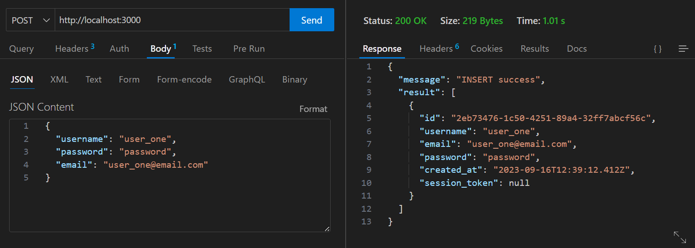
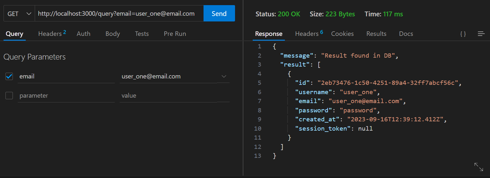
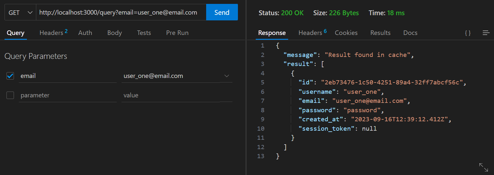
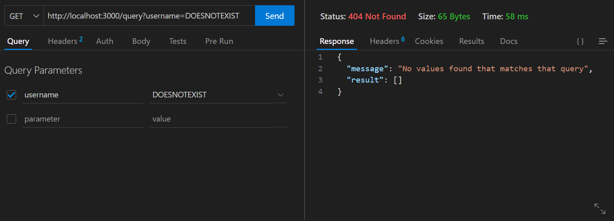
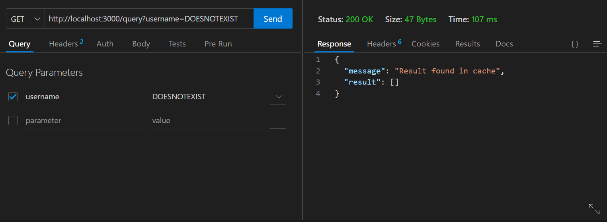

# Docker-Postgres-Redis-Node

# About

Node server that allows clients to save users info in a Postgres DB. A write-through caching pattern is used so that upon update of the primary DB the data is also added in the (Redis) cache. Queries can be done on the DB based on user id, username or email. A cache-aside (lazy loading) pattern is used so that the server checks the cache first before checking the DB (and any data found in a DB lookup is added to the cache). The Node server, Postgres DB, and Redis cache all live on separate containers but still are able to communicate with one another. This was mostly a small project to learn and experiment with Redis and Docker.

# Features

- Docker
- Redis
- Write-through and cache-aside caching patterns
- Postgres
- Node Express server

# Note

- The cache uses sql queries as keys. This can result in stale data being sent back to the client on occasions.
- Secrets (Docker Swarm or Kubernetes) would be the ideal way for storing DB/cache URLs and passwords, but were beyond the scope of this exercise. Instead, secret .txt files are manually copied over to /run/secrets/ directory to simulate the process of consuming secrets.
- Bind or volume mounts could have been created to persist DB/cache data but I chose not to since this is a test project.
- For dev purposes I could have created a volume mount with the 'node' folder so code could be updated inside the 'server' container without having to rebuild the image (would also need to update Dockerfile with a new stage that allows hot-reloading). This project was small enough where that was unnecessary but is something to consider on larger projects.

# Walkthrough

- Using Thunder Client we send a POST request from localhost:3000. This gets forwarded to port 3000 in 'server' container. The server will INSERT the user info into the postgres DB, found in 'database' container. The server will return a message and the user info upon successful save (found on the right hand side below):

 
 

- Now, we can fetch information from the server. First, the server checks the cache to see if data pertaining to the query exists. If it does exist in the cache, the server will return the cache hit. If there is a cache miss, we make a trip to the DB and then save the DB result into the cache (cache-aside). In the picture below, since this is the first time we are running this specific fetch, the data is not in the cache, so we have to get the information from the DB instead. The DB query result will be saved in the cache.

 
 

- Every subsequent fetch for this information will now result in a cache hit- we do not need to query the DB.

 
 

- If we query for information that does not exist, the same process occurs (only this time the data will be an empty array): check cache first, return cache data if cache hit, query DB and save to cache if cache miss. The first picture below shows the result of querying the DB (since this is the first time making this specific request) for data that does not exist. Next time we query for the same information will result in returning the empty array from the cache.

 
 

# Things That Can Be Improved

- Add TTL so Redis items can expire
- Config Redis to take snapshot to save data + volume
- Move Redis password out of docker-compose.yml

# References

- [AWS Whitepaper on caches](https://docs.aws.amazon.com/whitepapers/latest/database-caching-strategies-using-redis/welcome.html)
